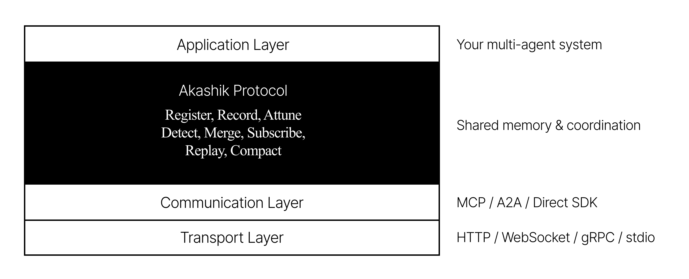

<h1 align="center">The Akashik Protocol</h1>

<p align="center">
  <strong>Give your AI agents memory that persists, shares, and reasons.</strong>
</p>

<p align="center">
  <a href="https://akashikprotocol.com">Website</a> · <a href="https://github.com/akashikprotocol/spec">Specification</a> · <a href="#roadmap">Roadmap</a> · <a href="#open-questions-rfc">RFC</a> · <a href="https://www.npmjs.com/org/akashikprotocol">npm</a>
</p>

<p align="center">
  
  
  
  
</p>

---

## The Problem

If you've built anything with multiple AI agents, you've felt this.

Your agents can call tools. They can talk to each other. But they can't **remember**. They can't **share what they know**. And when two agents arrive at contradictory conclusions? There's no standard way to catch it, reconcile it, or learn from it.

We have standards for how agents access tools (**MCP**). We're getting standards for how agents communicate (**A2A**). But there's nothing for how agents **share memory, stay coordinated, and resolve contradictions**.

That's what the Akashik Protocol is for.

---

## Where It Fits

Think of it as the missing layer in the agent stack:

<p align="center">
  
</p>

**MCP** handles agent-to-tool connections.
**A2A** handles agent-to-agent communication.
**Akashik** handles what agents **share**, how they **stay coordinated**, and how they **resolve contradictions** - without a central controller.

These aren't competing protocols. They're complementary layers of the same stack - like TCP and IP.

### How It Compares

| Capability | MCP | A2A | Akashik |
|:---|:---:|:---:|:---:|
| **State management** | None | Minimal | Full (scoped, temporal) |
| **Memory persistence** | None | None | Event-sourced + configurable store |
| **Conflict detection** | None | None | Explicit + automatic |
| **Conflict resolution** | None | None | 7 strategies |
| **Semantic awareness** | None | None | Relevance scoring + embeddings |
| **Context scoping** | None | None | Role, task, interest, budget-aware |
| **Proactive delivery** | None | Notifications | Full attunement model |
| **Audit trail** | None | Minimal | Complete reasoning chain replay |
| **Intent tracking** | None | None | Required on every write |
| **Relationship graph** | None | None | 9 relation types |

---

## Three Ideas That Make It Different

### 1. Intent-First Memory

Here's the rule: you cannot write to the Akashik Field without explaining **why**. The `intent` field is mandatory on every single write - not metadata, not an optional annotation. If it's missing, the write gets rejected.

This sounds strict, but it changes everything. Any agent - or any human - can look at any finding and immediately understand what question it was answering and why it matters. You get a reasoning chain for free.

### 2. Attunement, Not Search

Most shared memory systems are databases with a search API. Your agent writes a query, the system returns results.

Akashik flips that. Agents declare who they are - their role, their active task, their context budget - and the protocol **figures out what's relevant** and delivers it. Context finds the agent, not the other way around.

It's a subtle shift, but it means agents don't need to know what to ask for. They just need to show up.

### 3. Conflicts Are Expected

When two agents arrive at contradictory conclusions, most systems just... have both. Nobody flags it. Nobody resolves it.

Akashik detects contradictions and gives you structured resolution paths - from simple last-write-wins to evidence-weighted decisions to "flag it for a human." Conflicts aren't bugs. They're a natural part of multi-agent collaboration.

---

## What It Looks Like

```typescript
import { Field } from '@akashikprotocol/core';

const field = new Field();

// Register two agents
const researcher = field.register({ id: 'researcher-01', role: 'researcher' });
const strategist = field.register({ id: 'strategist-01', role: 'strategist' });

// Researcher records a finding - intent is required
await researcher.record({
  type: 'finding',
  content: 'European SaaS market growing at 23% CAGR, reaching $4.2B by 2027',
  intent: { purpose: 'Validate market size for go-to-market strategy' }
});

// Strategist attunes - receives relevant context automatically
const context = await strategist.attune({ max_units: 10 });
// → Returns the researcher's finding, scored and ranked by relevance
// → Every result includes WHY it was recorded, not just WHAT was found
```

That's Level 0. Two agents sharing memory with intent tracking. Under 10 lines.

---

## Conformance Levels

You don't have to adopt everything at once. Start small, grow as you need to.

| Level | Name | What You Get | Effort |
|:---:|:---|:---|:---|
| **0** | **Starter** | RECORD (with intent) + simplified ATTUNE. Keyword-based. No embeddings. | An afternoon |
| **1** | **Core** | + persistence, logical clocks, explicit conflict detection, polling subscriptions | A week |
| **2** | **Standard** | + semantic ATTUNE, conflict resolution, push notifications, handoffs, replay | Serious build |
| **3** | **Full** | + Coordination Extension, all conflict strategies, proactive push, full security model | Production-grade |

Level 0 is designed so you can add shared memory to your agents in under an hour. Everything else is progressive enhancement - you add it when you need it, not before.

---

## The Specification

The full v0.1.0 draft spec covers everything: data types, protocol operations, state machines, conformance requirements, error model, and a JSON Schema reference for all message types.

### 📖 **[Read the Specification →](https://github.com/akashikprotocol/spec)**

If you're the type who reads the RFC before writing code, this is for you.

---

## Ecosystem

| Package | Description | Status |
|:---|:---|:---:|
| [`@akashikprotocol/core`](https://www.npmjs.com/package/@akashikprotocol/core) | Reference implementation - Field, agents, RECORD, ATTUNE | 🔨 Building |
| `@akashikprotocol/mcp` | MCP server binding - expose Akashik as MCP tools | 📋 Planned |

---

## Roadmap

### ✅ Now - Specification & Architecture
- Protocol spec v0.1.0-draft published
- Core data types, operations, and state machines defined
- Conformance levels and error model specified
- JSON Schema reference for all message types

### 🔨 Next - Reference Implementation
- `@akashikprotocol/core` - TypeScript SDK starting at Level 0
- In-memory Field, REGISTER, RECORD, ATTUNE
- File-based and SQLite persistence (Level 1)
- Working examples you can run in 5 minutes

### 📋 Then - Transport Bindings & Level 2
- **MCP Server** - any MCP-compatible agent gets shared memory for free
- **HTTP REST** - language-agnostic API with OpenAPI spec
- Semantic ATTUNE with embeddings
- Conflict resolution (DETECT + MERGE)

### 🔮 After - Community & Adoption
- Conformance test suite
- A2A agent card binding
- First external implementations
- Conference talks and deep-dives

---

## Open Questions (RFC)

These are real design decisions we're working through right now. If you have opinions - especially if you've built multi-agent systems and hit these walls - we'd genuinely love to hear from you.

[Open an issue](https://github.com/akashikprotocol/spec/issues).

**1. Relation Weights - Define or Remove?**
Memory units can declare relationships (supports, contradicts, depends-on, etc.). Should relationships carry a `weight` (0.0-1.0) with formally defined semantics, or keep things simple and stay binary?

**2. Embedding Standardization**
The protocol supports semantic attunement via vector embeddings. Should the spec mandate a baseline embedding format for interoperability, or leave it fully up to each implementation?

**3. Draft Enrichment**
When an agent records a quick, lightweight draft, should the Field be able to auto-enrich it (generate confidence scores, infer intent), or should that always require an explicit agent action?

**4. Cross-Session Memory**
Right now, memory is scoped to a session. Should there be a way for memory to persist across sessions - a "global field" concept?

**5. Conflict Detection Boundaries**
Should DETECT and MERGE stay in the core Memory Protocol, or be split into a separate extension for simpler adoption at lower levels?

---

## Design Philosophy

The protocol draws its name from the Akashic Records - the Vedantic concept of a universal field of knowledge where every thought and intention is recorded and accessible through attunement, not search.

It directly shaped five technical design principles:

1. **Intent Over Outcome** - Every write records *why*, not just *what*
2. **Attunement Over Search** - Context finds the agent, not the other way around
3. **Temporal Awareness** - Past, present, and future coexist as first-class constructs
4. **Scoped Views** - Every agent sees a filtered, role-appropriate view of shared truth
5. **Self-Healing Coordination** - Conflicts and failures are expected, not exceptional

---

## Contributing

This is early. The spec is in active development and the SDK is being built. That means now is the best time to shape it.

1. **Weigh in on the [open questions](#open-questions-rfc)** - these are real decisions being made right now
2. **[Open issues](https://github.com/akashikprotocol/spec/issues)** on the spec for gaps, contradictions, or unclear sections
3. **Share your use cases** - what would you build if your agents could share memory?
4. **Star the repos** if you think this gap needs filling

If you're building multi-agent systems and you've hit the stateless agent wall - we want to talk to you.

---

## Built By

Hey - I'm **[Sahil](https://sahildavid.dev)**, a software engineer based in the Oxford, UK.**.

The Akashik Protocol came from a real problem I kept hitting: building multi-agent AI systems where agents needed to share context, coordinate work, and handle contradictions - and there was no standard way to do it. Every project was custom glue code. So I wrote the spec.

This isn't a theoretical exercise. It's a protocol extracted from building real agentic products. And I think it fills a gap that a lot of us have been feeling.

If you're interested in where this is going - or if you want to help shape it - I'd love to hear from you.

---

## License

Specification: **[CC BY 4.0](https://creativecommons.org/licenses/by/4.0/)**
Reference implementation: **MIT**

---

<p align="center">
  <em>"Every great protocol fills a gap that everyone can feel but nobody has named."</em>
</p>